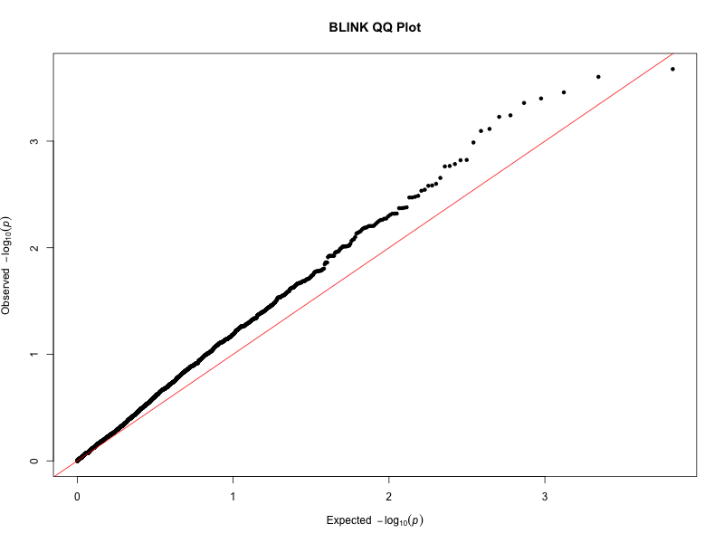
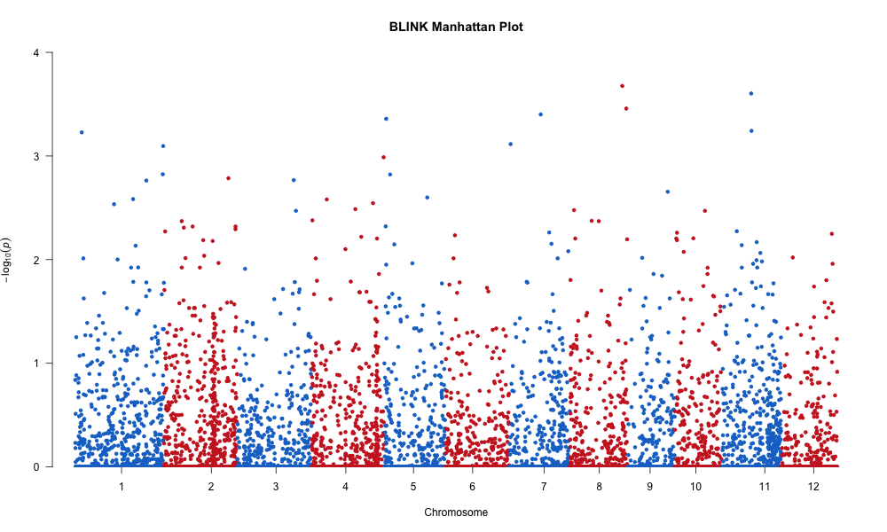

# 🌾 BLINK-Wrapper: A Command-Line GWAS Tool with Docker

This repository provides a lightweight, user-friendly R-based command-line wrapper for conducting **Genome-Wide Association Studies (GWAS)** using the [BLINK](https://github.com/YaoZhou89/BLINK) algorithm. It supports VCF genotype input and phenotype files and outputs GWAS results with Manhattan and QQ plots.


---

##  Features

- Accepts VCF genotype and phenotype files as input
- Automatically performs GWAS using BLINK
- Generates Manhattan and QQ plots
- Dockerized: No need to install R or BLINK manually
- Works on macOS (Intel/Apple Silicon), Linux, and Windows with Docker

---

## Requirements 

Before running this tool, please make sure the following are installed:

### 1. [Docker Desktop](https://www.docker.com/products/docker-desktop)
- For **macOS (Intel or Apple Silicon)**, download the version for your chip
- For **Windows** or **Linux**, follow the platform-specific installation

To verify Docker is installed, run:
```bash
docker --version
```

### 2. Git (optional, for cloning the repository)
If you don’t have Git yet:
- macOS: Install via Homebrew
```bash
brew install git
```
- Windows: Install Git for Windows
- Linux:
```bash
sudo apt install git
```

## Folder Structure
```pgsql
.
├── data/                # Input files (phenotype and VCF)
│   ├── test-pheno.txt
│   └── test-150.vcf.gz
├── blink_results/       # Output directory (auto-created)
├── BLINKscript.R        # R script that runs the BLINK analysis
├── run_blink.sh         # Bash wrapper for convenience
├── Dockerfile           # Container setup
└── README.md
```

## Input Format

Phenotype
- Tab-delimited .txt file
- First column: Taxa (sample names)
- Next columns: traits to analyze
```txt
Taxa	TestPheno
IRIS_313-8285	2.3
IRIS_313-8349	3.1
...
```
Genotype
- A compressed or plain VCF file
- Must contain genotype fields in GT format (e.g., 0/0, 0/1)
- Chromosome values must be numeric

## How to Use

### 1. Clone this repository
```bash
git clone https://github.com/bdramirez26/BLINK-Wrapper
cd BLINK-Wrapper
```
### 2. Build the Docker image

On Apple Silicon (M1/M2/M3/M4):
```bash
docker build --platform linux/amd64 -t blink-wrapper .
```
On Intel/AMD systems:
```bash
docker build -t blink-wrapper .
```
### 3. Run BLINK inside the container
This command runs the analysis using the test data in /data:
```bash
docker run --rm \
  --platform linux/amd64 \
  -v "$(pwd)":/app \
  blink-wrapper \
  data/test-pheno.txt \
  data/test-150.vcf.gz \
  blink_results
```
This will create a folder blink_results/ containing results and plots.

## Output

Your output folder (e.g., blink_results/) will contain:
- blink_gwas_results.csv
- blink_full_results.rds
- manhattan_plot.png
- qq_plot.png

## Example Plots
These are generated automatically and saved in your output directory.

<p align="center">  <br> <em>QQ plot from BLINK results</em> </p> <p align="center">  <br> <em>Manhattan plot from BLINK results</em> </p>

## Test Data
Sample VCF and phenotype files are provided in the data/ folder, allowing you to test the pipeline immediately.


